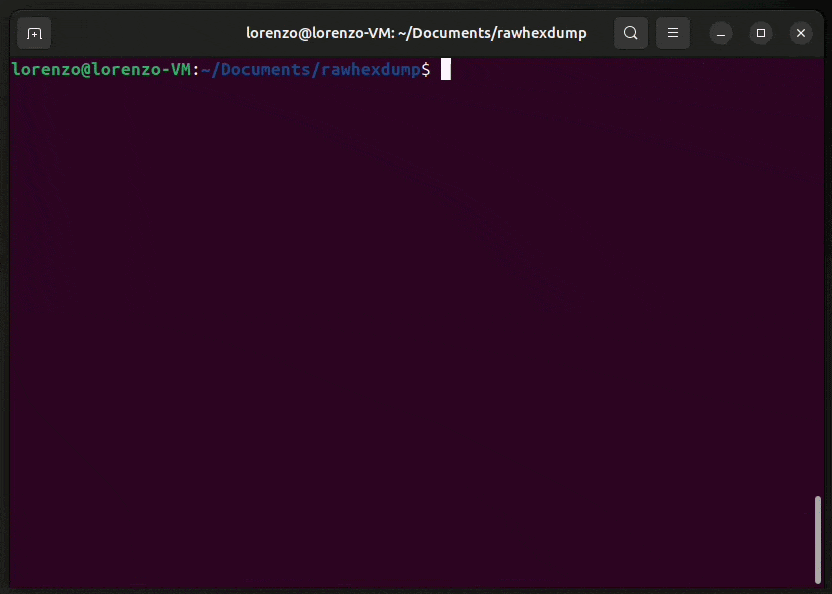

# rawhexdump



**rawhexdump** is a small and limitated copy of the Linux *hexdump* utility.

## Why?

I wrote **rawhexdump** to improve my personal knowledge of the *C language*, *libc*, *signals*, how *Unix-like terminals* work, and the *VT100 escape sequences*.

## Requirements

- Unix-like operating system
- GNU Make (`make`)
- GNU GCC compiler (`gcc`)

**rawhexdump** does not depend on any library.

It uses fairly standard [VT100 escape sequences](https://vt100.net/docs/vt100-ug).

## Build

Use the following command inside the `rawhexdump/` directory:

```
make
```

The executable file `rawhexdump` should be present inside the created directory `build/`.

## Usage

```
Usage: build/rawhexdump [-v | --version] [-h | --help] <file-path>

Usable commands:
         W = move up one row
         S = move down one row
         A = move up one page
         D = move down one page
         H = hexadecimal view (linked to char view)
         C = char view (linked to hexadecimal view)
    CTRL+C = compacted char view
    CTRL+Q = quit
```

## Resources

The resources that I used to create rawhexdump are the following:

- [snaptoken - Build Your Own Text Editor](https://viewsourcecode.org/snaptoken/kilo)
- [GitHub - antirez/kilo](https://github.com/antirez/kilo)
- [rkoucha - Playing with SIGWINCH](https://www.rkoucha.fr/tech_corner/sigwinch.html)
- [italiancoders - Come scrivere un signal handler in C](https://italiancoders.it/signal-come-si-scrive-un-signal-handler-in-c/)
